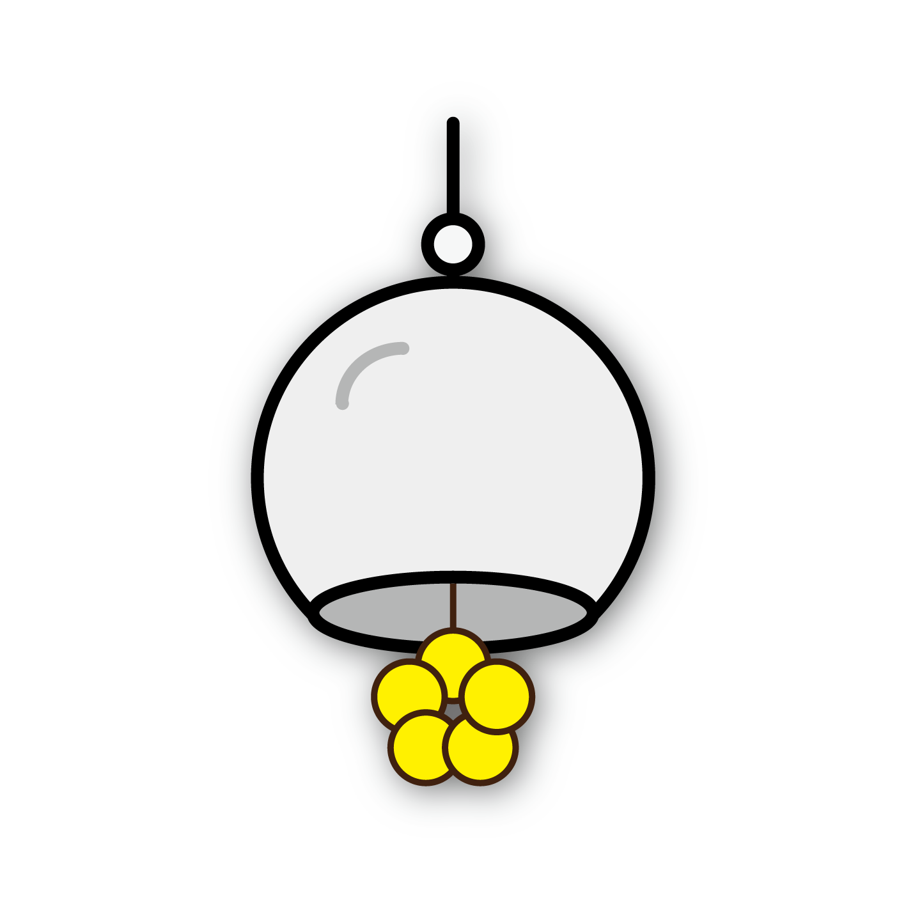
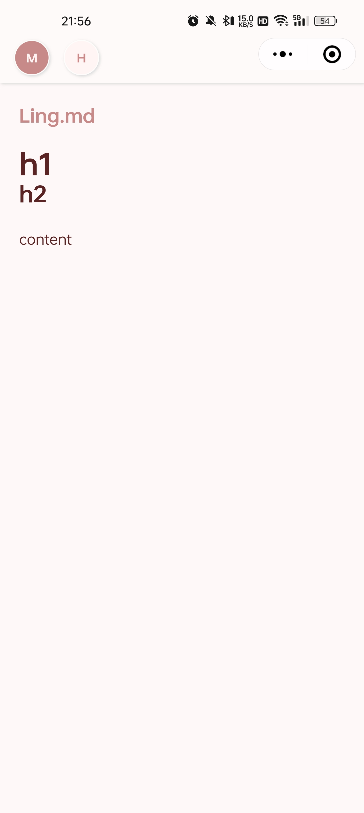
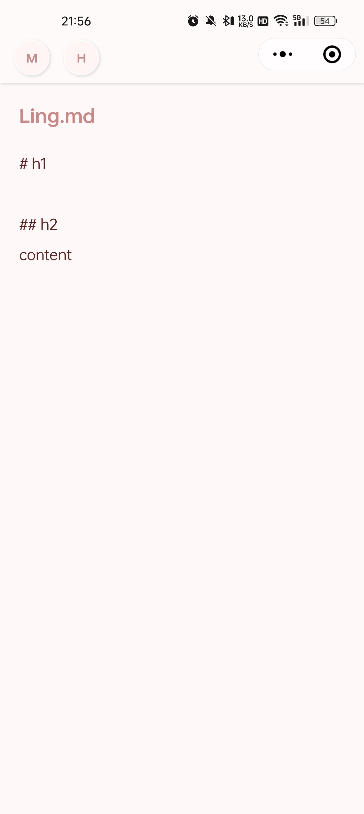
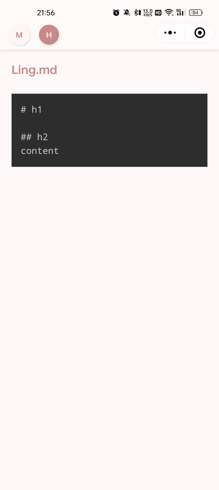

# 风铃读件（废案）

    

## 介绍

这是一款使用 uni-app 框架开发的微信小程序，用于读取微信文件并解析显示。

备案要我有两个手机号，我就一个号，家里人的不想填，就这样吧。有能力可以自己部署（用微信开发者工具打开 [unpackage/dist/dev/mp-weixin](unpackage/dist/dev/mp-weixin)），用测试号运行到微信上，可以正常用。

讲道理是不能将 [unpackage](unpackage) 也提交进仓库的，为了方便直接使用微信开发者工具打开我们将其包含进该仓库。

## 截图

